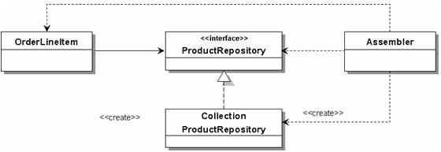
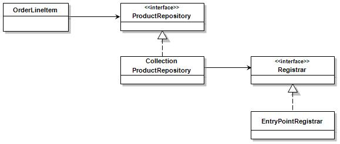

### [Domain-Driven Design의 적용](http://aeternum.egloos.com/1218235) 시리즈를 공부하며 정리한 내용입니다.

# PART 3. Dependency Injection과 Aspect-Oriented Programming

## 도메인 객체의 생명주기
- 생성된 객체가 어플리케이션의 생명주기 동안 동일한 객체로 참조되기 위해서는 REPOSITORY가 필요하다.

- 생성된 객체는 REPOSITORY에 의해 관리되며 객체가 필요한 경우 REPOSITORY를 통해 해당 REFERENCE OBJECT를 얻을 수 있게 된다. 

- 물론 REPOSITORY를 통해 등록된 객체와 조회된 객체의 식별자(identity)는 동일해야 한다. 

### REPOSITORY 관점에서의 삭제
- 더 이상 해당 객체를 REFERENCE OBJECT로 취급하지 않겠다는 것을 의미한다. 
- 즉, 시스템이 해당 주문 객체의 추적성을 보장하지 않겠다는 의미이다.
- 이것을 주문 객체 자체의 소멸과 혼동해서는 안 된다.

## 객체 그리고 영속성(Persistence)
부족한 메모리 공간에 이것 저것 쑤셔 넣다 보면 결국 빈번한 스와핑(swapping)으로 인해 전체적인 성능이 저하될 수 밖에 없다.

시스템은 자기가 현재 처리해야 할 고객, 주문, 상품을 제외한 모든 다른 정보들은 최대한 빨리 잊어 버려야 한다. 단기 기억 상실증은 시스템으로 하여금 전체적인 성능을 유지하게 하는 훌륭한 질병

일차 저장소인 메모리에서 활발하게 뛰어 놀던 도메인 객체를 붙잡아 이차 저장소에 동면시키는 기법을 영속성(Persistence) 메커니즘이라고 한다.

### 관계형 데이터베이스를 사용하는 이유
- 관계형 데이터베이스 기술은 수십 년 동안 점진적으로 성장하고 발전한 안정적인 기술이다.
- 객체와 관계형 데이터베이스 간에 임피던스 불일치가 존재한다.

### 임피던스 불일치
임피던스 불일치를 해결하기 위한 방법은 객체 계층과 관계형 데이터베이스 계층 사이에 가상의 객체 지향 데이터베이스를 구축하는 것이다.

#### 객체 관계 매핑(Object-Relation Mapping)
- 임피던스 불일치를 소프트웨어적으로 해결하는 것

#### 객체 관계 매퍼(Object-Relation Mapper, ORM)
- 객체 관계 매핑을 수행하는 소프트웨어

### 지금까지 배운 개념
- 어플리케이션의 생명 주기 동안 지속적으로 추적해야 하는 객체들을 REFERENCE OBJECT로 모델링
- 연관된 REFERENCE OBJECT들을 AGGREGATE라고 하는 하나의 객체 클러스터로 식별
- 각 AGGREGATE에 대해 ENTRY POINT를 선정
- ENTRY POINT 별로 REPOSITORY를 할당
- REPOSITORY를 통해 AGGREGATE의 생명 주기를 관리

지금까지는 REPOSITORY를 REFERENCE OBJECT의 메모리 컬렉션을 관리하는 객체로만 바라 보았다. 

### 지금부터 배울 개념
이제 REPOSITORY의 개념을 REFERENCE OBJECT의 영속성을 관리하는 객체로 확장해 보도록 하자.

## 영속성(Persistence)과 REPOSITORY
REPOSITORY는 도메인 객체 생성 이후의 생명주기를 책임진다.

### REPOSITORY의 특징
- 도메인을 모델링 할 때는 REPOSITORY를 통해 모든 객체가 메모리에 있다는 착각을 줌으로써 하부 인프라 스트럭처에 대한 부담 없이 도메인 로직에 집중할 수 있다. 
- 하부의 데이터 접근 로직을 REPOSITORY에 집중시킴으로써 도메인 로직과 데이터 접근 로직을 자연스럽게 분리시킬 수 있다. 
- 영속성 메커니즘이 REPOSITORY 내부로 제한되어 있기 때문에 도메인 모델에 영향을 미치지 않고서도 영속성 메커니즘을 교체하는 것이 가능하다.
- 모든 객체 저장소와 접근을 REPOSITORY로 위임함으로써 클라이언트가 모델에만 초점을 맞추도록 한다.

한마디로 REPOSITORY는 영속성 메커니즘을 캡슐화하기 위한 훌륭한 지점이다.

### 결합도
#### 결합도를 낮추는 일반적인 방법
- 직접적인 의존 관계를 제거하고 두 클래스가 추상에 의존하도록 설계를 수정하는 것이다. 
- 즉, 구체적인 클래스가 추상적인 클래스에 의존하게 함으로써 전체적인 결합도를 낮추는 것이다. 
- 구체적인 클래스들 간의 의존 관계를 추상 계층을 통해 분리함으로써 OCP를 위반하는 설계를 제거할 수 있다.

#### 두 클래스가 인터페이스에 의존하도록 수정하는 가장 간단한 방법은 무엇일까? (예시)
- ProductRepository를 인터페이스와 구현 클래스로 분리
- OrderLineItem과 ProductRepository의 구현 클래스가 ProductRepository의 인터페이스에 의존

하지만 OrderLineItem이 직접 ProductRepositoryImpl을 생성할 경우 **여전히 OrderLineItem과 ProductRepositoryImpl을 간에 강한 결합 관계가 존재한다.**

#### 문제의 원인
- 객체의 구성(Configuration)과 사용(Use)이 OrderLineItem 한 곳에 공존하고 있다.

객체의 구성과 사용이 한 곳에 모여 있을 경우 객체 간의 결합도가 높아진다. 

#### 해결 방법
- 외부의 객체가 OrderLineItem과 ProductRepositoryImpl 간의 관계를 설정하도록 함으로써 구성을 사용으로부터 분리시키는 것이다.

## 의존성 주입

협력하는 객체들의 외부에 존재하는 제 3의 객체가 협력하는 객체 간의 의존성을 연결하는 것을 의존성 주입(Dependency Injection)이라고 한다.

직접 의존성 주입을 수행하는 인프라 스트럭처 코드를 작성할 수도 있으나 이를 수월하게 해주는 다양한 오픈소스 프레임워크가 개발되어 있다.

이 프레임워크들은 의존성을 주입할 객체들의 생명주기를 관리하는 컨테이너 역할을 수행하기 때문에 경량 컨테이너(lightweight container)라고도 불린다.

그 중 Spring 프레임워크를 사용해보자.

### Spring의 특징
- Spring은 컨테이너에서 관리할 객체를 등록할 때 객체의 인스턴스를 하나만 유지할 지 필요 시 매번 새로운 인스턴스를 생성할 지를 정의할 수 있다.
- 오버라이딩이 불가능하고 결합도가 높은 static메소드를 사용하지 않고서도 객체를 SINGLETON으로 유지할 수 있다.
- SINGLETON으로 구현된 Registrar를 인터페이스와 구체적인 클래스로 분리함으로써 낮은 결합도와 높은 유연성을 제공할 수 있다.

아래는 Spring의 의존성 주입을 통해 약하게 결합된 클래스 구조도이다. 구체적인 클래스가 추상적인 인터페이스에 의존한다.

OrderLineItem은 Order에서 직접 new연산자를 사용하여 인스턴스를 생성한다. 

즉, OrderLineItem은 **Spring의 빈 컨텍스트에 의해 관리되지 않는 객체**이므로 빈 컨텍스트로부터 획득되는 다른 REPOSITORY들처럼 **Spring의 의존성 주입 서비스를 받을 수 없다.**

따라서 Spring 컨테이너 외부에서 생성되는 OrderLineItem의 ProductRepositoty는 null이 된다.

Spring 컨테이너 외부에서 생성되는 객체에 대해 의존성 주입을 제공하는 방법을 알아보자.

## AOP
Spring 컨테이너 외부에서 생성되는 객체에 대해 의존성 주입을 제공하는 가장 효과적인 방법은 AOP(Aspect-Oriented Programming)를 적용하는 것이다. 

### AOP란
- 시스템 내의 관심사를 분리하는 프로그래밍 기법이다.
- AOP를 사용하면 시스템의 핵심 관심사(Core Concerns)와 횡단 관심사(Cross-Cutting Concerns)의 분리를 통해 결합도가 낮고 재사용이 가능한 시스템을 개발할 수 있다.

### Spring에서의 AOP
- 프록시 기반 메커니즘에 AspectJ를 통합하여 Spring 컨테이너 **외부에서 생성되는 도메인 객체에 Spring 컨테이너에서 관리하는 빈을 의존 삽입할 수 있도록 해주는 기능**을 제공한다.
- 클래스 로더가 클래스를 로드 할 때 바이트 코드를 수정하여 Spring 빈을 삽입하는 것이다.

이제 Order에서 new 연산자를 사용하여 OrderLineItem을 생성하더라도 CollectionProductRepository를 의존 삽입하는 것이 가능해 진다 !

## 정리 (이전 파트와 달라진 점)
도메인 클래스들이 REPOSITORY의 인터페이스에만 의존할 뿐 실제적인 구현 클래스에 의존하지 않게 되었다. 

이제는 메모리 컬렉션을 처리하는 REPOSITORY의 내부 구현을 데이터베이스에 접근하는 REPOSITORY로 대체하더라도 다른 클래스에 영향을 미치지 않을 것이다.

도메인 클래스가 REPOSITORY의 인터페이스에만 의존하기 때문에 Mock 객체를 사용하여 데이터베이스 없이도 테스트하는 것이 가능해졌다.